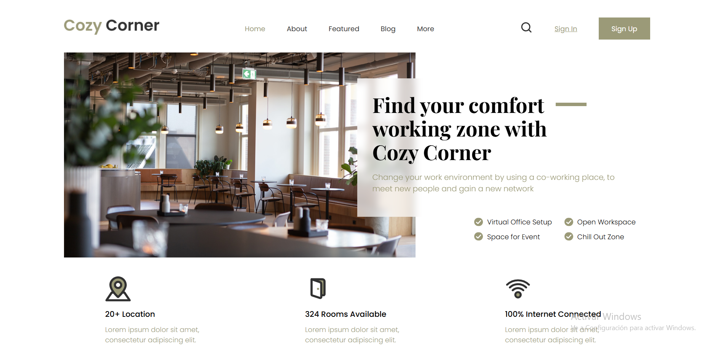

# CSS Coworking Space

This is a frontend project built with HTML, CSS (using Sass), and Vite.  
It features a responsive **header** and **hero section** for a coworking space website.

## 🖥 Preview

> The preview image shows the final version of the layout. It includes a styled header with navigation and a modern hero section.

## 🚀 Technologies Used

- HTML5
- CSS3 (Sass)
- Vite (as development build tool)
